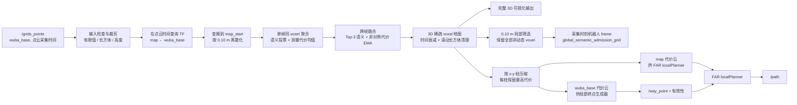

# 局部三维语义 Voxel 地图、代价计算与发布流程

本文档说明 `local3d_semantic_voxel_map` 当前代码中，从仿真 packed-RGB 点云或
`/grids_points` 输入到局部三维 voxel 融合、通行代价计算、局部非动态筛选、代价点云
发布，以及测试局部终点和 FAR `localPlanner` 使用这些结果的完整流程。

文档对应的主要文件如下：

- 参数配置：[`config/grids_points_voxel_map.yaml`](config/grids_points_voxel_map.yaml)
- ROS 节点：[`src/semantic_voxel_map_node.cpp`](src/semantic_voxel_map_node.cpp)
- Voxel 地图与代价融合：[`src/semantic_voxel_map.cpp`](src/semantic_voxel_map.cpp)
- Top-3 语义证据融合：[`src/semantic_fusion.cpp`](src/semantic_fusion.cpp)
- 测试局部终点生成器：[`src/test_local_goal_selector.cpp`](src/test_local_goal_selector.cpp)
- Voxel 地图启动文件：[`launch/grids_points_voxel_map.launch`](launch/grids_points_voxel_map.launch)
- FAR 联调启动文件：[`launch/grids_points_far_planner_test.launch`](launch/grids_points_far_planner_test.launch)

## 1. 总体数据流



这里需要区分两类数据：

1. 地图内部和 RViz voxel 输出是完整的三维数据。
2. `traversability_cost_cloud*` 是给二维局部规划使用的柱状压缩结果；同一
   `(x,y)` 下只输出一个点。

## 2. 当前配置下的坐标系

在 `grids_points_far_planner_test.launch` 中：

| 名称 | 当前值 | 用途 |
|---|---|---|
| 全局跟踪坐标系 | `map` | 查询机器人在全局中的实时位姿，FAR 使用 |
| 车体/输入坐标系 | `wuba_base` | `/grids_points` 和局部代价云使用 |
| 地图存储坐标系 | `map_start` | 以第一帧有效点云的机器人位姿作为原点 |

第一帧能够成功获得 TF 的点云到来时，节点记录：

```text
T_map_wuba(t0)
```

并发布静态变换：

```text
map -> map_start = T_map_wuba(t0)
```

之后点云使用下面的相对位姿进入地图：

```text
T_map_start_wuba(t) = inverse(T_map_wuba(t0)) * T_map_wuba(t)
```

因此在第一帧时刻，`wuba_base` 在 `map_start` 中的位置和姿态均为零。机器人
后续的运动都相对于这个初始位姿表达，避免 bag 中起点本身的全局坐标影响局部
地图观察和 RViz 显示。

## 3. 输入点云及必要字段

同一个节点可使用两套互不混流的配置：

| 数据源 | 配置/启动文件 | 布局 | 原始语义 | 规范标签 |
|---|---|---|---|---|
| 仿真 | `semantic_voxel_map.yaml` / `semantic_voxel_map.launch` | 640x480 展平图像 | `semantic_color(float32 packed RGB)` | 配置映射到 0、2、3、11 |
| bag/实机 | `grids_points_voxel_map.yaml` / `grids_points_voxel_map.launch` | 非组织点云 | `semantic_lable(uint32)` | 0-18 原样使用 |

仿真颜色在融合前通过 `semantic_label_remap` 统一为当前准入分类：黑色地面映射
为 0，灰色结构映射为 2，蓝色低障碍映射为 3，紫色动态障碍映射为 11。输出
`label` 和全局准入语义因此与 bag 数据一致，但 `rgb` 仍按照各自配置的原始调色板
显示。两套 YAML 还显式清空/关闭对方专属参数，重复切换 launch 时不会受到 ROS
参数服务器残留值影响。

当前输入为：

```text
/grids_points
```

配置为 `input_layout: point_cloud`、`point_stride: 1`，即逐点处理输入，不进行
图像像素步进采样。上游点云已经去畸变，当前节点不会再次做运动去畸变。

需要的字段为：

| 字段 | 是否必要 | 当前配置 | 含义 |
|---|---:|---|---|
| `x/y/z` | 是 | 固定字段名 | 点在输入点云坐标系中的位置 |
| 语义字段 | 是 | `semantic_lable` | 类别 ID；保留上游现有拼写 |
| 置信度字段 | 否 | `semantic_confidence` | 缺失时使用 `default_semantic_confidence` |
| 代价字段 | 否 | `traversability`，找不到时尝试 `cost` | 上游测得的通行代价 |

代价统一限制在 `[0,1]`：

- `0`：容易通行；
- `1`：不可通行或最高风险。

如果一个点既没有有效语义，也没有有效测量代价，该点不会进入地图。

## 4. 时间戳处理

时间处理遵循“点云采集时间就是本帧数据时间”的原则。

### 4.1 输入帧

节点执行以下检查：

1. `header.stamp == 0`：丢弃整帧；
2. 时间戳等于最近成功处理帧：作为重复帧丢弃，不计入静态确认帧数；
3. 时间戳早于最近成功处理帧：视为时间回退，清空局部地图、准入筛选快照和
   初始参考后，以新时间域重新处理该帧；
4. 使用 `message->header.stamp` 查询
   `global_frame <- message->header.frame_id`；
5. 如果该时刻 TF 不可用：丢弃整帧，不使用最新 TF 代替。

因此不会把 `ros::Time(0)` 查询到的“最新变换”与 `ros::Time::now()` 混在一起。

### 4.2 Voxel 时间衰减

每个 voxel 的 `last_observed` 使用命中它的输入点云时间。每次成功处理新点云后，
以当前点云时间执行：

```text
当前点云时间 - voxel 最后观测时间 > decay_seconds
```

满足条件的 voxel 被删除。当前 `decay_seconds: 0.5`。

这是传感器时间衰减，不是墙上时间衰减。点云停止时，衰减时钟也停止；回放 bag
暂停不会使地图继续消失。

### 4.3 发布时刻

- 成功处理一帧后，以该帧 `message->header.stamp` 原子生成并缓存完整
  `voxel_cloud`；
- `semantic_voxels`、`traversability_voxels`、`voxel_cloud`、局部准入筛选云和
  代价云都使用 `latest_processed_frame_stamp_`；
- `publish_rate` 定时器只重发同一采集时刻快照，不刷新 header，也不推进衰减；
- `map -> wuba_base` 到 `wuba_base` 的变换也严格查询这个同一时刻；
- 如果该时刻变换失败，节点发布同一时间戳的空局部代价云，以清除 latched 的旧
  结果，不会继续使用过期局部地图。

当前 `publish_rate: 10.0`，因此正常情况下重发周期约为 `0.1 s`。输入停止时，
输出 stamp 保持不变，不会制造“新鲜地图”。

## 5. 点进入地图前的过滤

单个输入点依次经过：

1. PointCloud2 缓冲区和字段读取检查；
2. `x/y/z` 有限值检查；
3. 可选 `max_range` 球形量程检查；
4. 以输入点云坐标系表达的局部长方体检查；
5. 变换到 `map_start`；
6. `min_z/max_z` 地图坐标高度检查；
7. 语义与测量代价有效性检查。

### 5.1 当前滚动长方体

当前配置为：

```yaml
local_box_enabled: true
local_box_min_x: -10.0
local_box_max_x:  10.0
local_box_min_y: -10.0
local_box_max_y:  10.0
local_box_min_z:  -2.0
local_box_max_z:   4.0
```

即车体坐标系中 `20 m × 20 m × 6 m` 的长方体。它跟随 `wuba_base` 的位置和
完整姿态旋转，不是固定在 `map` 轴方向的盒子。

长方体有两次作用：

- 当前帧中位于盒外的点，在坐标变换和融合前直接拒绝；
- 每次成功输入帧在提交快照前，按该帧机器人位姿清除历史地图中已经落到盒外的
  voxel。

六个边界可以不对称。例如需要“前方多、后方少”时，可以设置：

```yaml
local_box_min_x: -4.0
local_box_max_x: 16.0
local_box_min_y: -8.0
local_box_max_y: 8.0
```

### 5.2 `max_range`、`local_radius` 和 `min_z/max_z`

- `max_range` 是输入传感器坐标系中的球形异常远点/可靠量程过滤；`<= 0` 禁用。
  当前为 `-1.0`，因为滚动长方体已经限制输入范围。
- `local_radius` 是旧的球形滚动地图范围。启用长方体时它被忽略，当前为 `-1.0`。
- `min_z/max_z` 是点变换到地图存储坐标系后的绝对高度过滤，与跟随车体旋转的
  `local_box_min_z/max_z` 含义不同。

## 6. Voxel 化与单帧聚合

地图采用稀疏哈希表。当前 `voxel_size: 0.10`，位置到索引的计算为：

```text
kx = floor(x / voxel_size)
ky = floor(y / voxel_size)
kz = floor(z / voxel_size)
```

同一帧中落入同一 voxel 的多个点不会逐个更新历史地图，而是先形成一个
`ScanVoxel`：

- 语义：按点的语义置信度对各 label 投票；
- 本帧 label：选择权重最大的类别；
- 本帧语义置信度：`获胜类别权重 / 全部有效语义权重`；
- 测量代价：该 voxel 内全部有效点代价的算术平均值。

单帧聚合避免点密度不同导致同一帧对历史证据重复加权过多，也减少地图锁和融合
次数。

## 7. 跨帧语义融合

每个 voxel 保存三个最强语义假设和一个 `others` 证据桶，而不是简单覆盖类别或
平均 label。

一次有效语义观测会：

- 增强被观测类别的 log-evidence；
- 降低其他候选类别和 `others` 的证据；
- 新类别从 `others` 概率质量中引入；
- 只保留证据最强的 Top-3 类别。

把 Top-3 和 `others` 的 log-evidence 归一化后得到类别概率。Voxel 的语义代价
是概率期望：

```text
C_semantic = P(others) * C_unknown
           + sum(P(class_i) * C(class_i))
```

各类别的 `C(class_i)` 在 YAML 的 `semantic_classes` 中配置。例如当前 road 为
`0.05`，building/wall/person/car 等为 `1.0`。未配置类别使用
`unknown_cost: 0.50`。

## 8. 测量代价的跨帧融合

输入 `traversability` 先在单帧 voxel 内取均值，然后与历史测量代价做非对称指数
移动平均：

```text
C_measured_new = C_measured_old
               + alpha * (C_observation - C_measured_old)
```

其中：

- 新观测更危险时使用 `cost_rise_alpha: 0.70`；
- 新观测更安全时使用 `cost_fall_alpha: 0.15`。

因此危险信息能够较快生效，而从危险恢复为安全需要更多连续观测，减少代价因单帧
噪声快速下降。

## 9. 语义代价与测量代价的最终融合

当前方法为：

```yaml
traversability_fusion_method: confidence_weighted_raise
semantic_risk_alpha: 0.80
```

当语义和测量代价同时存在时：

```text
C_final = C_measured
        + semantic_risk_alpha * P_dominant
        * max(0, C_semantic - C_measured)
```

这个策略的含义是：

- 几何/上游测量代价作为基础；
- 语义只在判断“比测量更危险”时抬高最终代价；
- 抬高量由主类别置信度控制；
- 语义不会把已有的高测量风险降低。

如果只有语义，则最终代价为语义代价；如果只有测量代价，则最终代价为测量代价。

代码另外支持：

| 方法 | 计算方式 |
|---|---|
| `maximum` | `max(C_semantic, C_measured)` |
| `weighted_average` | 两种代价按 `semantic_cost_weight` 加权平均 |
| `confidence_weighted_raise` | 当前使用的单向语义风险抬升 |

`semantic_cost_weight` 只在 `weighted_average` 模式下生效。

### 9.1 仿真语义云的地形高度代价补偿

`/semantic_pcl/semantic_pcl` 只有 `x/y/z/semantic_color`，没有上游
`traversability`。对这一路输入，节点在生成同一帧发布快照时，从地形标签 `0/1/9`
建立局部 x-y 高度柱，并比较同一柱及附近地形柱的高度范围。默认规则为：

```yaml
terrain_height_cost_enabled: true
terrain_height_difference_threshold: 0.15
terrain_height_neighborhood_radius: 0.20
terrain_height_obstacle_cost: 1.0
```

邻近地形高度差严格大于 0.15 m 时，突变两侧的地形 voxel 都提升为代价 1.0。
0.20 m 搜索半径用于跨过深度边缘过滤留下的窄空洞。这样楼梯踏面和普通地面即使
语义上都属于可通行地形，其交界/立面仍会作为几何障碍进入局部代价云和 admission
筛选输出，而平坦地面保持低代价。

这一步只修改发布快照中的最终 `traversability`，不伪造
`measured_traversability`，也不修改语义 `label`。带有实测代价的 voxel 一律不参加
高度推断；因此 `/grids_points` 配置显式关闭该功能并完整使用 bag 中的实测值。

## 10. 地图维护

地图同时通过三种机制限制规模：

1. `decay_seconds`：按输入点云时间删除长时间未观测的 voxel；
2. 滚动长方体：删除当前机器人局部盒体之外的 voxel；
3. `max_voxels`：超过容量后优先淘汰最旧 voxel。

当前 `max_voxels: 300000`。地图快照和融合操作由互斥锁保护，点云回调负责更新并
提交采集时刻快照，发布定时器只负责重发已经提交的快照。

## 11. 从 3D voxel 到规划代价云

完整三维地图可能在同一 `(x,y)` 下包含多个不同高度的 voxel。发布规划代价云前，
`traversabilityColumns()` 按 `(kx,ky)` 分组：

```text
每个 x-y 柱输出 cost 最大的 voxel
```

如果最大代价相同，选择 `z` 更低的 voxel。输出点包含：

```text
x, y, z, intensity
```

其中 `intensity = C_final`。这一步不是新的代价计算，而是把已经融合好的三维代价
压缩成 FAR 和局部终点生成器可消费的二维柱状点云。

需要注意：只要一个柱中存在高风险 voxel，该柱的输出就是高风险。这是一种偏保守
的投影方式。

## 12. 发布话题

所有输出 publisher 都是 queue size 1 且 latched。

| 话题 | 类型 | 坐标系 | 内容/用途 |
|---|---|---|---|
| `/local_3d_semantic_voxel_map/semantic_voxels` | `visualization_msgs/Marker` | `map_start` | 完整 3D voxel，按语义类别着色 |
| `/local_3d_semantic_voxel_map/traversability_voxels` | `visualization_msgs/Marker` | `map_start` | 完整 3D voxel，绿-黄-红代价着色 |
| `/local_3d_semantic_voxel_map/voxel_cloud` | `sensor_msgs/PointCloud2` | `map_start` | 完整 3D 融合结果及所有语义/代价字段 |
| `/local_3d_semantic_voxel_map/global_semantic_admission_grid` | `sensor_msgs/PointCloud2` | `wuba_base`（bag）/`base_link`（仿真） | 同一 0.10 m 局部快照剔除动态物体后的结果，字段兼容 `/grids_points` |
| `/local_3d_semantic_voxel_map/confirmed` | `sensor_msgs/PointCloud2` | 同上 | 与筛选输出相同，便于调试 |
| `/local_3d_semantic_voxel_map/rejected_dynamic` | `sensor_msgs/PointCloud2` | 同上 | 默认排除但仍保留在完整局部地图的动态标签点 |
| `/local_3d_semantic_voxel_map/rejected_unknown` | `sensor_msgs/PointCloud2` | 同上 | 当前为空；未知非动态点也会保留 |
| `candidates/rejected_rear/revocation_*` | `sensor_msgs/PointCloud2` | 同上 | 兼容保留的空调试云；当前筛选器不维护这些状态 |
| `/local_3d_semantic_voxel_map/traversability_cost_cloud` | `sensor_msgs/PointCloud2` | `map` | 柱压缩后的全局代价云，供 FAR |
| `/local_3d_semantic_voxel_map/traversability_cost_cloud_wuba` | `sensor_msgs/PointCloud2` | `wuba_base` | 同一代价云在最新点云时刻变换到车体坐标系，供局部终点选择 |

`voxel_cloud` 的主要字段包括：

```text
x, y, z, rgb, label, semantic_confidence,
semantic_cost, measured_traversability, traversability, intensity,
observations, semantic_observations, traversability_observations
```

其中 `traversability` 和 `intensity` 都是最终融合代价。若 voxel 从未收到直接测量
代价，`measured_traversability` 为 `NaN`，用来与真正的 `0.5` 测量值区分。

### 12.1 局部非动态筛选

尽管为保持接口兼容仍沿用 `global_semantic_admission_grid` 话题名，它现在不是全局
点云，也不维护独立历史。节点直接遍历本帧已经完成融合、衰减和局部空间裁剪的
0.10 m voxel 快照，并保留除明确动态标签 `11-18` 之外的全部 voxel。因此普通
低代价地面、草地/楼梯踏面、静态标签 `2-8` 和未知非动态点都继续输出。动态点仍
完整保留在 `voxel_cloud` 供局部避障，只从 admission 输出中排除。

`traversability` 不再决定某个非动态点是否进入该话题，而是决定其下游用途：普通
地面保持低代价；仿真中高度突变超过 0.15 m 的地形边界被提升到 1.0，SSMI adapter
再以 0.75 为障碍阈值将这些高代价点编码为墙体障碍。

筛选点使用该帧采集时间的机器人位姿，从 `map_start` 变换到 `wuba_base`（bag）或
`base_link`（仿真）。坐标、frame 和 `header.stamp` 一起缓存；定时器重发时不会按
机器人新位姿重新变换。输出字段为：

```text
x(float32), y(float32), z(float32), traversability(float32),
semantic_lable(uint32)
```

### 12.2 与持久化全局地图的边界

当前节点不再执行 8 帧稳定性确认、0.40 m 再体素化、候选超时、后方走廊或反向
撤销状态机。一个点是否出现在筛选话题中，完全由当前缓存的局部 voxel 快照决定；
局部衰减或新观测改变快照后，下一帧筛选结果自然随之改变。

如果 SSMI/OctoMap 订阅该话题并长期累计，永久化、自由空间清除及误分类撤销策略
属于下游全局建图器，不能再把本话题本身理解为“已经稳定确认的永久静态地图”。

## 13. 测试局部终点生成器

`test_local_goal_selector` 只用于当前联调测试，不是一个全局任务规划器。它订阅：

```text
/local_3d_semantic_voxel_map/traversability_cost_cloud_wuba
```

然后在 `wuba_base` 中执行：

1. 建立二维近邻网格；
2. 从前向距离、横向距离、航向角和终点代价满足条件的点中抽取候选；
3. 检查终点周围 `safety_radius` 内没有硬障碍；
4. 从车体原点到候选点按 `path_step` 检查直线路径；
5. 未被代价云覆盖的路径位置按未知处理并拒绝；
6. 根据距离、终点风险、净空、路径平均风险和航向综合评分；
7. 从评分最高的 `top_k` 中按固定随机种子选择一个；
8. 在代价云时间戳查询 `map <- wuba_base`，发布全局 `/way_point`。

当前 launch 中主要约束为：

```text
前向距离：1.0 ～ 3.0 m
横向范围：±1.5 m
最大航向角：±60 deg
终点代价阈值：0.30
硬障碍代价阈值：0.75
安全半径：0.40 m
选择周期：0.10 s
最多详细评估候选：10
```

输出包括：

- `/way_point`：`map` 坐标系中的测试局部终点；
- `/test_local_goal_selector/valid`：本轮是否找到安全终点；
- `/test_local_goal_selector/candidate_marker`：通过检查的候选点；
- `/test_local_goal_selector/goal_marker`：最终选中的局部点。

## 14. FAR localPlanner 如何使用结果

联调 launch 给 FAR 的关键输入为：

| FAR 输入 | 当前话题 |
|---|---|
| 里程计 | `/fusion_localization` |
| 静态/代价障碍点云 | `/local_3d_semantic_voxel_map/traversability_cost_cloud` |
| 局部目标 | `/way_point` |
| 目标有效性 | `/test_local_goal_selector/valid` |

FAR 输出 `/path`。这里 FAR 使用的是 `map` 坐标的全局代价云；测试终点生成器使用
的是 `wuba_base` 坐标的局部代价云，不要把两个话题互换。

测试 launch 没有启动 `pathFollower`，所以只进行地图、终点和轨迹可视化，不会向
机器人发送速度命令。

目标看门狗设置为：

- 超过 `0.5 s` 没有新的有效局部终点，发布停止路径；
- 连续 3 次收到 `valid=false`，发布停止路径；
- 后续收到新有效目标后自动恢复规划。

## 15. 运行方法

### 15.1 只运行 voxel 地图

```bash
source /opt/ros/noetic/setup.bash
source build/devel/setup.bash --extend
roslaunch local3d_semantic_voxel_map grids_points_voxel_map.launch
```

这要求外部已经发布 `/grids_points` 以及相应 TF。

### 15.2 播放 bag 并联调 FAR、终点生成器和 RViz

```bash
source /opt/ros/noetic/setup.bash
source /home/yanaibo/mapless_navigation/far_planner/devel/setup.bash
source /home/yanaibo/mapless_navigation/local_3d_semantic_voxel/local3DSemanticVoxelMap/build/devel/setup.bash --extend

roslaunch local3d_semantic_voxel_map grids_points_far_planner_test.launch
```

不播放包内 bag、改用实时话题：

```bash
roslaunch local3d_semantic_voxel_map grids_points_far_planner_test.launch \
  play_bag:=false rviz:=true
```

如果 ROS 报告找不到 launch 文件，通常需要重新编译并重新 source 当前工作空间：

```bash
catkin_make
source build/devel/setup.bash --extend
rospack profile
```

## 16. RViz 建议

固定坐标系使用：

```text
map_start
```

建议观察：

- `Semantic Voxels`：语义融合是否稳定；
- `Traversability Voxels`：完整三维代价；
- `Voxel Cloud`：检查字段和点位置；
- `Global Cost Cloud`：FAR 实际接收的 `map` 代价云；
- `Local Cost Cloud`：终点生成器实际接收的 `wuba_base` 代价云；
- `/way_point` 和 Goal Marker：选定局部目标；
- `/free_paths`、`/path`：FAR 候选轨迹与最终轨迹；
- `Path Goal Alignment`：局部目标和路径端点之间的误差。

地图规模较大时，不建议同时显示两个大体量 `CUBE_LIST` 和完整 voxel cloud，避免
RViz 渲染影响对算法频率的判断。

## 17. 常用检查命令

检查话题频率：

```bash
rostopic hz /grids_points
rostopic hz /local_3d_semantic_voxel_map/voxel_cloud
rostopic hz /local_3d_semantic_voxel_map/traversability_cost_cloud_wuba
rostopic hz /way_point
rostopic hz /path
```

检查坐标系与时间戳：

```bash
rostopic echo -n 1 /grids_points/header
rostopic echo -n 1 /local_3d_semantic_voxel_map/traversability_cost_cloud_wuba/header
rostopic echo -n 1 /way_point/header
rosrun tf tf_echo map wuba_base
```

查看代价云字段：

```bash
rostopic echo -n 1 /local_3d_semantic_voxel_map/traversability_cost_cloud/fields
rostopic echo -n 1 /local_3d_semantic_voxel_map/voxel_cloud/fields
```

清空或保存地图：

```bash
rosservice call /local_3d_semantic_voxel_map/reset
rosservice call /local_3d_semantic_voxel_map/save_map
rosservice call /local_3d_semantic_voxel_map/load_map
```

## 18. 常见现象与定位

### 局部代价云暂时为空

检查对应输入点云时间是否存在 `wuba_base <- map` TF。实现会在 TF 失败时主动发布
空云，避免终点选择器继续使用 latched 的旧数据。

### 地图在 bag 暂停后没有继续衰减

这是预期行为。时间衰减使用点云采集时间，只有成功处理下一帧时才执行清理。

### `voxel_cloud` 点很多，但代价云点明显更少

这是预期行为。代价云已经按 `(x,y)` 柱压缩，每柱只保留最高风险 voxel。

### 局部终点频率比代价云低

先检查 `selection_period`。此外，终点生成器还会做候选近邻、安全半径、直线路径
覆盖和净空检查；`max_candidates_evaluated` 用于限制每轮详细评估数量。

### 轨迹端点没有严格到达 `/way_point`

FAR 输出的是当前周期内选择的有限长度局部运动 primitive，不保证最后一个路径点
与 waypoint 完全重合。应同时检查路径到目标的最小距离、端点距离、目标时间年龄，
以及目标有效性，而不能只比较最后一个路径点。
